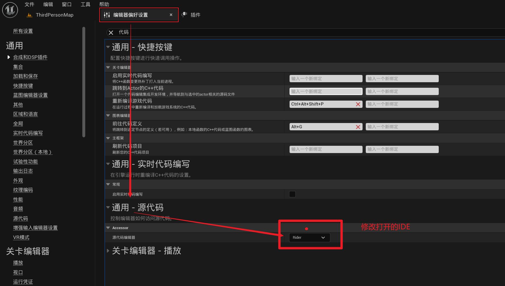

# Course Pre:

C++射击游戏是最难的。尤其是其中的网络服务部分，包括multiplayer gameplay ,replication ,游戏优化，游戏中战斗，匹配游戏匹配游戏状态 ,服务器倒带，以及伤害预测等等

Course Structure：

Multiplayer Plugin + the game prohect

能够学习到的就是客户端预测和服务端倒带（延时补偿）

延时补偿算法使用的是延时补偿组件实现的。


### 梳理课程架构：

- multiPlayer plugin 创建一个实际的插件 。这个插件能够装载在任何地方，这个组件包含了创建在线回话和连接玩家的功能。
- 该游戏项目。这里就是创建角色和武器以及多人游戏相关的东西的地方。


> 那就从插件开始看吧，反正也不会做插件，看看又何妨

课程首先说了点对点传输信息的弊端

- 人一多就必须会导致大量数据在网络中传输。假如10个人，每个人都要给另外九个人发送改变的信息
- 没有Authority，作弊极其简单，而且哪台机器上的实例是正确的也无法确定。没有一个正确的标准

然后讲到了CS服务器的做法，两种一种是listen Server一种是Dedicated Server listenServer是将一个玩家的机器作为Server，dedic ated Server 是一台专属服务器，没有玩家在上面进行游戏，也没有画面渲染。

‘cs就是客户端向服务端发送请求，服务端处理之后再将结果返回给客户端，比如客户端一个跳，服务端计算跳多高多远之后，将数据复制到客户端上’

哦~我说怎么会没有创建专属服务器的办法，原来是最后一个as aclient 专属服务器在后台运行了，所以看到的运行的游戏实例都是客户端。


然后引出了LAN Connection.也就是Local Area NetWork

#### 本地连接：

当几台机器连接到一个网络中，每台机器都有自己的IP地址，所以当他们连在一个网路中时通过ip可以互相访问。

怎么在虚幻中通过IP进行连接呢？这是不是点对点连接?

1. 在key 1上节点连接 open level

open level节点参数：Levelname,关卡名字 Oprions:能够通过输入listen 将其配置为监听服务器

然后其他客户端就能够接入这个监听服务器，在课程中，这个接入服务器在2键上进行

2. key 2上只需要连接一个节点 execute command  然后在其中写 open ipv4即可。

**操作：**

- 机器1按下1键，机器1打开新关卡并变成listen Server。
- 机器2按下2键，执行open ipv4的网址也就进到了机器1的关卡中

##### 使用C++怎么实现呢？`


客户端有两种方式连接到listen 服务器，一种调用的openLevel和一种是用的PlayerController上的callClientTravel，但是。看源码发现其实openLevel中包含的有ClientTravel

easy的，现在开始online subsystem


### 5.online Subsystem

就是几个客户端并不知道彼此的ip地址该怎么进行网络连接呢？--》这涉及到了虚幻的online Subsystem.

首先复习下网络ip相关知识，一个路由其能够给连接此路由的几个主机分配IP地址，但是这是内网IP,外部链接是连接到路由器上的，其他地区网络通过ip访问你的时候只能访问到路由的ip,并不能根据你路由器内部主机的ip地址进行直接访问。

那是怎么找到其他主机玩家的ip地址的呢？

有以下几种方式：

DS:

连接到一个服务器是，其提供一个IP地址链表供你连接。然后显示你朋友连接的情况

listenServer：

一个作为listen，等待其他玩家加入，但是其他玩家不还是要知道这个listen的ip地址，怎么解决？所以这需要有个中间阶段。需要一个服务器托管。也就是需要一个中间阶段，。listenServer向服务器发送一个信号，然后服务器将信息发送到其他要加入的客户端这样，这个Service通常也有其他功能，比如安全和好友系统。但是这些东西很复杂，需要重写游戏系统等，使其与PlayStation或者Xbox这些平台兼容，所以我们像学一些函数库就能解决这些问题连接到任何想要的服务的话就更好了，所以有了UE的online Subsystem

你的游戏连接到这些Service的时候，该服务有自己的代码处理玩家之间的连接

UE可以供我们选择连接不同平台，起会处理所有特定平台的细节，也就是说UE提供了一个抽象层供处理网络连接。我们只关心UE的网络连接相关代码即可。

>  所以加一个中间层就能解决很多问题这句话含金量还在增加

所以我们就是用Steam的平台进行托管使用，目标：将网络连接封装成一个插件，以后用的时候直接装上插件就行了。行为描述;点击链接，直接就能够加入游戏


- 总结：我们知道了在不知道各个玩家具体ip的情况下需要一个中间层处理，可以是专有服务器，也可以是这些Steam，xbox等代理服务器用于处理连接。
- 我们还知道了ue有自己的代码库处理这些连接到在线服务的子系统 online subsystem.
- onlinesubsystem是一个抽象层

online Subsystem包含内容：一系列接口friend Interface achievements interface sessions interface等

我们在哪里处理这些接口呢?engine.ini 文件

```
[OnlineSubsystem]
DefaultPlatformService=<Platform>
```

`IOnlineSubsystem::Get()`返回值类型是IOnlineSubsystem* 类型

获取到指针之后就能够访问之前提到的不同的接口。

- 目前我们关心的就是session Interface		

  - 主要功能 creating ，managing，And destroying online session 

  - searching for sessions,matchmaking

- session可以看做什么呢? 

  - an instance of the game running on the server 

  - advertised (players can join)or private(invite only)

##### lifetime of a session

create Session => wait for palyers to join => register players => start session => play => end session => unregister player => update session or destroy session

```C
Function:
CreateSession()
FindSession()  
JoinSession()  
StartSession()  
DestroySession() 
```

  menuSystem连接到plugin

#####  我们先实现的功能：

在一个菜单上点击按钮，触发处理函数，创建session。之后打开大厅层，等待其他玩家进入

其他玩家点击join按钮的时候， 能够调用findsession()，返回搜索的结果并选择一个有效的session、之后就是joinsession()进入，然后就获取到了正确的IP地址。之后就是执行了ClientTravel 


##### Summary:

- ​	了解了子系统
- 了解了session接口以及相关函数，并了解了建立连接的生命周期
- 有了我们要是实现的目标，一个客户端通过onlinesubsystem 建立session 然后其他客户端加入


### 6.Configuring a project for steam

1. 在编辑器中启动插件 onlinesubsystem steam

2. 之后回到编辑器，找到plugin，下面的每一个插件都是一个模块，为了online Subsystem Steam 能够被索引，需要处理一下。**就是将其添加到构建文件中**
3. 在build.cs文件中添加了 onlinesubsystemSteam和OnlineSubsystem然后编译即可
4. 配置项目使用Steam作为在线子系统。应该是ini


5. 生成新的sln 文件，把引擎和ide都关掉，删除一些项目中自动生成的文件【saved，intermediate,Binaries】。
6. 右键uprojedt文件，点击 Generate VIsuaStudio project files即可
7. 重新点击uproject文件将提示报错，是否rebulid ,rebulid即可

现在已经该项目已将Steam作为网络连接的子系统了。然后我们可以通过代码访问这个子系统了。

##### Summary:

- 添加插件配置Steam作为在线子系统 	
- 在public dependency module添加了在线子系统和Steam在线子系统模块
- ini文件中添加默认配置


### 7.Accessing the online system


智能指针类型在使用的时候需要使用包装器包装一下，不能够直接使用.

然后从编辑器打开发现获取的链接类型打印的是NULL，其实是能够连上的，只是这个获取到的类型是NULL,而在打包完成之后，打开Steam客户端，就能够发现打印de确实是Steam。

##### summary:

- 在character中访问了在线子系统

- 创建线程安全的session类型的智能指针

- 打印在screen上的方法::GEngine->AddOnScreenDebugMessage()

  - 其中使用了FString::printf(),c风格的字符串进行数据传递

  - ```c++
    GEngine->AddOnScreenDebugMessage(
    -1,
    15.f,
    FColor::blue,
    FString::Printf(TEXT("xxxxxx: %s"),*OnlineSubsystem->GetSubSystemName().ToString())
    );
    ```

- 如果文件有.dll报错，就将二进制文件，saved等删掉，重新生成即可 

- 运行打包后的项目确实能够发现打印了steam字样，而且右下角有弹窗提示steam,因此也验证了网络找到的是steam在线子系统.ssteam online subsystem 

next mission：

get the session interface

call the createSession()function

verify we have a new session

### 8.Creating a Session

1. 回顾委托delegate是怎么工作的

#### Delegate

可以被看做一个对象，它持有一个函数的引用。

> 委托的定义：它允许你将一个或多个函数注册到委托实例上，之后可以通过调用这个委托实例来执行这些函数。

例子：一个委托绑定了函数ABC,当其他地方调用这个委托的时候，这个委托执行函数ABC,

在线会话使用委托：

因为创建，加入游戏回合等内容都需要传递信息。

当我们进入会话接口并调用CreateSession()时，信息将会被发送至steam平台，会话将会被创建,steam必须将信息发送回我们的机器，让我们知道其创建一个session会话的行为。

The Session Interface使用委托做到这一点，the session Interface定义了一组委托类型，保存了一恶搞委托列表，当合适的时候，其将通过触发事件来委托。

。。。。有点乱说实话，就是完成执行之后，call委托，委托中执行其他函数这样。

本节任务1：创建委托变量并创建一个回调函数

1. 哦~，委托也是类型的，这个倒是没注意。视频中要创建一个FOnCreateSessionConpleteDelegate类型的委托
2. 然后创建一个回调函数OnCreateSessionComplete
3. 绑定委托和回调函数，在哪里绑定呢？Construct！使用括号的形式对委托对象进行初始化绑定

任务2：是时候在会话接口上调用Createsession函数了。

1. 检测当前有没有默认的session，有的话删除
2. 删除之后创建自己的session
3. 调用Delegate，完成时触发回调函数
4. 创建sessionSetting指针，调用函数，创建session

任务3:实现回调函数:

根据回调结果打印不同的数据在窗口。


关于委托为什么在.h文件声明之后还要在构造函数初始化：

```C
AUENet_CCharacter::AUENet_CCharacter():
CompleteDelegate(FOnCreateSessionCompleteDelegate::CreateUObject(this,&AUENet_CCharacter::OnCreateSessionComplete))
{

}
```

###### 关键点解析

1. **委托实例化**
   你提到的 `CompleteDelegate` 是类的一个成员变量（委托类型）。在构造函数的初始化列表中，通过 `CreateUObject` 创建委托实例并绑定到 `OnCreateSessionComplete` 方法，这确实相当于 "实例化" 委托。
2. **`CreateUObject` 的作用**
   `CreateUObject` 是虚幻引擎特有的委托绑定方式，专门用于绑定到 UObject 派生类的非静态成员函数。它会：
   - 保存目标对象的引用（`this`）
   - 保存目标函数的指针（`&AUENet_CCharacter::OnCreateSessionComplete`）
   - 确保委托调用时能正确路由到目标对象的成员函数
3. **为什么不在头文件声明时初始化？**
   委托类型的成员变量通常不在头文件中直接初始化，因为：
   - 需要在运行时绑定到具体对象实例（`this` 指针）
   - 构造函数初始化列表是初始化委托的最佳位置
   - 若在头文件中初始化静态绑定，会导致所有类实例共享同一个绑定状态

##### Summary:

- Delegate在管理会话的时候怎么发挥作用的
- 创建了一个FOnCreateSessionCompleteDelegate,然后绑定了一个委托函数
- 将委托添加进session Interface‘s Delegate list 列表是什么意思？
  - emmm,添加到列表的意思就是构造函数中，CreateUObject这样的操作，其并不是“实例化委托”，因为委托已经被声明为成员变量了，这里的蔡总是向该委托的回调列表中添加一个具体的函数指针。  多个函数可以绑定同一个委托，事件触发时按顺序执行所有绑定函数。

### 9.setup for joining Game Session

任务1：创建蓝图可调用事件 joinGameSession()

任务2：为了找到Session ，需要创建一个委托和回调函数

任务3：有一个委托，有一个回调函数，然后绑定在一起，标准流程了哈哈哈

任务4：绑定完了，it's time to set some Serach Setting了

###### 定义JoinGameSession():

- 加入的话涉及搜索方面的函数，还要选择搜索到的session的类型进行区分，所以先设置一下相关参数。

```C
SessionSettings->MaxSerachResult = 1000;
SessionSettings->bIsLanQuery = false;
```

- 我们想要搜索会话，就要用到那个统一抽象出来的网络接口还记得吗？？onlinesessionInterface .我们要用的就是其FindSessions函数。
- 不要忘记了，在此函数中要触发委托呢。所以创建一个对应的handle。其监控此操作：就是当这个findSession函数找到Session之后，就触发这个委托，然后调用回调函数。

任务5：回调函数处理

当触发回调函数时，意味着找到了相关的Session，所以可以在回调函数中打印相关找到的session名称。

Summary：

在创建委托、函数、并进行绑定之后，在函数中设置handle设置委托监控

接着通过设置OnlineSearch相关属性之后，使用通用接口进行findSession操作。

下一节就是getIPto join 然后就是加入GameSession了。	


10.Steam Regions

需要在Steam中设置Region，相同区域的两台机器才有可能被搜索到

### 11.Join the session

###### task1: create lobby level

在onCreateSessionComplete的函数中，之前我们仅仅进行了打印字符串的操作，在后续中，我们需要将其Travel 一个新的关卡，使用世界指针，进行Travel 

###### task2:指定匹配类型，以便在找到会话后检查该类型

通过SessionSetting的成员函数Set()可以创建不同的匹配类型，当后续find的时候可以根据匹配类型的不同，匹配对应的类型。后面第三个参数是该Session进行广播的形式，EOnlineDataAdvertisementType

###### task3:检查匹配类型

任务2中创建Session的时候指定了匹配类型，其他主机加入的时候就要筛选了也就是获取SearchResult中的成员变量，在这里使用对应的get函数

task4:Figure Out Which IP Address to join  

找到了对应键值对的Session之后终于到了加入这个Session的环节了，怎么加入呢？得知道IP地址。

- 为了得到要去的IP地址需要使用Session的joinSession函数
- 为了使用这个函数就得创建委托进行触发，然后执行joinSession函数。
- 执行完之后就会触发回调函数 

> 理一下，找到Session之后会触发OnlineSessionInterface的joinSession。记得该函数可是绑定了一个AddOnJoinSessionCompleteDelegate_handle的委托的，也就是说，当join Session完成之后就触发这个委托，调用回调函数了。emmm...顺序是OK的。

task5:有了地址之后就该travel过去了。

只需在OnjoinSessionComplete中从GameInstance获取firstLocalplayerController之后进行travel即可。


##### Summary：

- 创建共同游玩的Level
- 创建match type
- 其他主机寻找时匹配matchType之后进行加入游戏会话，
- 加入Session之后触发回调函数，回调函数中获取IP之后，进行travel

Next：

下节课就是创建一个网络连接的插件了，这样就能够在使用的时候即插即用。而且character中并不是网络连接应该在的地方（这就和GamePlay相关了）

### $$12.Creating a Plugin

当在Editor使用某个插件的时候会在uproject文件中显示开启了某个插件，就比如我们用了Steam的OnlineSubsystem

uproject中会显示：

```c++
"Plugins":[
    {
        "Name":"OnlineSubsystemSteam",
        "Enabled":true
    }
]
```

- 要明白UE其实就是由很多MODULE组成的，而且其可以包含PLUGIN
- MODULE和PLUGIN是分层的。引擎层ENGINE MODULE 游戏项目层PROJECT MODULE .游戏层依赖引擎层，但是引擎层不能依赖游戏层【因为引擎层必须能够在没有任何项目的情况下进行构建】
  - ENGINE PLUGIN可以依赖其他ENGINE PLUGIN 等等，如图所示：
    - 

Task1:Create own plugin:

创建插件简单的，只需要在PLUGIN界面点击create plugin就能够创建不同类型的插件

Task2： add dependencies 添加插件所需要的依赖项。

- 打开创建的PLUGIN，会发现有build.cs文件，这个文件中的Type说明这是一个Runtime类型的插件，这个Type有很多类型，什么editor.
- 但是我们要做的是我们创建的这个插件需要依赖其他插件，也就是OnlineSubSystem和onlinesubsystemSteam ，依赖他们也就是在uplugin文件中加上所以依赖插件的名字
- 别打错字了：

接着我们来看multiplayerSession插件中的build.cs文件，此文件和其他构建文件一样，能够指定编译时能够构建哪些模块

- 有publicDependencyModuleNames.AddRange和privateDependencyModuleNames.AddRange,这两者有什么区别呢？
  - private添加的将仅在private源文件中使用 	emm,这里加在线子系统的话还是加到public下吧

###  13.Creating own Subsystem

会话功能应该以谁为父类？

- 之前是放在了character中不合理，那放在GameInstance中呢？

  - 注意，Session并不是GameInstance的主要功能啊，要是有一个类实例和GameInstance一样共存就好了，这样他就可以独立处理多人在线会话了

  - 由此引出<u>Subsystem</u>。 SubSystem是引擎中自动实例化的类，并且能够被管理其生命周期

  - we can create a class derivers from base class:

  - ```C
    class UMyGameSubsystem : public UGameInstanceSubsystem
        
    1. d当UGameInstance创建的时候，子系统自动创建
    2. 游戏初始化的时候，子系统也被call初始化
    3. UGameInstance被shut down的时候Deinitialize将被call
    4.subsystem被Drop的时候，将会被垃圾回收掉
    ```

    

使用rider的时候，如何实现编辑器到编译器的跳转是能够跳转到rider的？



emmm，插件和MODULE不一样，MODULE纯纯的代码，但是插件中可以包含一些资产提供使用，比如插件中提供一些icon或者是预设的网格体以及一些武器模型等、

- 编辑器中可以访问的只是public文件夹	
- 复习下重新generated的时候删除哪些文件saved,binaries,intermediate(中间文件)，而这里有了plugin，所以我们进去也删除binaries和intermediate

### 14.Session Interface Delegates


task:创建函数，创建委托，绑定，以及在不需要委托的时候删除委托

首先我们知道SessionInterfaceFunctions都有啥：CreateSession()，findSession()，joinSession()，DestroySession()

又说了一遍委托使用时候的相关事项：

- Construct Delegate And bind callback 	
- add Delegate to Delegate list 将委托添加进委托list 实际操作也就是创建一个handle进行“监听”
- 一但我们用完这个委托，就需要使用handle从会话接口中删除这个委托。


委托具有不同参数传递的类型：


- 接着创建句柄，句柄用于委托

Summary：

- 创建了处理函数，创建l委托，创建了回调函数，创建了句柄。

Great Job!!!

### 15.The Menu Class

- 创建一个菜单类，使用C++制作一个widget作为蓝图widget的基类

- Task1：Create a menu class 

  - 创建一个Menu类，我们想实现的是创建在插件中，这样就即插即用了。所以在MultiPlayerSession中创建该类就行。

  - 该类中做一个函数，MenuSetUp()用于处理是否可视，是否显示在前端。

  - 但是在做函数之前，如果我们依赖一些MODULE，需要在该plugin中的build.cs文件中添加module

  - 添加完成之后就可以通过获取Controller然后对Ui进行处理了，什么出输入模式是InputModeData,配置相关的一些属性，以及鼠标的显示等

  - 接着就是在plugin中创建一个蓝图类的userwidget，然后修改其父类为Menu即可。

    

#### Summary:

- plugin中创建C++的Widget：Menu，写一个函数WidgetSetup()
- 创建蓝图类的WEB_Widget，然后修改器父类为Menu，如果Editor职工未能找到Menu则将清空缓存，重新Generate项目
- 在关卡蓝图中，创建WBP_Widget并调用函数即可

### 16.Accessing our Subsystem

##### task1：添加Button的callback

access our Subsystem

call our subsystem Function

- 我草，**从Editor创建的按钮能与C++创建的变量进行绑定**，但是要注意变量名称一定要一样。

##### Task2:期望通过C++实现点击按钮之后执行后续操作：

- 就是点击按钮之后调用的函数
- 将此函数绑定到点击事件，在c++中也就是委托
  - 怎么实现？-->在C++中重载Initialize（）函数。
  - 然鹅，你知道怎么绑定Button的onclicked委托事件吗？通过AddDynamic(this,&ThisClass::回调函数)；
  - 修改完代码之后如果构建失败，就删除缓存重新编译。
  - 有报错，是在使用智能提示的时候选了一些函数，然后自动加载include了一些莫名其妙的库，到时候检查的时候检查include仔细一些删除就行了


##### Task3:怎么实现在Menu类中访问子系统？

可以在进入程序时候的函数或者是initialize的地方获取**多人在线子系统**(MultiplayerSessionSubSystem)，然后保存在变量中。

所以我们要使用私有变量--“多人在线子系统”类型指针来存储这个地址。

Summary：

了解了Button怎么绑定回调函数，了解了编译保存的时候看一看是不是头文件里进了不该进的东西，了解了再Menu中使用指针访问自己创建的子系统类。

### 17.Create Session

multiplayerSessionSubsystem.cpp中的流程：CreateSession的流程：

- ​	判断SessionInterface是否可用
- 将Delegate注册到list中
- 对成员变量SessionSetting进行赋值
- 设置相关的Session的具体属性
- 调用Interface的CreateSession的函数。
- 如果创建失败，就销毁注册的Delegate

回到menu.cpp

回到绑定点击事件的callback那里，添加漫游Level的函数

打包之后发现可以实现按下按钮之后跳转到特定Level，但是没办法进行移动：原因：处理Widget的时候输出方式设置的只能对Widget进行操作的模式`FInputModeUIOnly`

只需要设置一个函数用于删除Widget，在跳转关卡之后调用此函数即可。应该用Delegate回调之后调用此函数?对的基类有在关卡跳转完之后回调的虚函数`OnLevelRemoveFromWorld`，我们只需要重写虚函数，在其中调用我们创建的`MenuTearDown`即可。	
