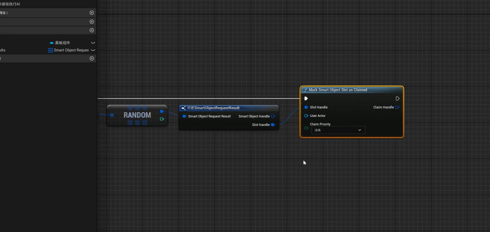

对话使用的struct 数据结构供datatable的使用，这样的datatable可以存储各种需要的信息，本次教程中仅使用了boolean IsNPC和string dialog


### 罗列下对话用到的相关蓝图：

首先是UI，玩家的Interaction组件，NPC上的datatable 增强输入转换逻辑


### 对话逻辑梳理

在player上的interaction 组件中有射线检测，射线检测到的actor保存为变量，然后再有dialog组件获取检测到的actor身上的datatable。然后再根据敌人身上datatable的信息进行显示提示按下空格继续交流，然后按下空格之后开始进行剧情推动 


### 为了实现逐行获取数据表中的对话信息：

dialog过程获取datatable，我们如果要使用的话，需要向将其存储为数组，然后再根据下标进行逐行显示。创建使用current Row，使其后续自加，然后实现逐行显示


### intercation交互组件

组件其实是为了显示一些EF交互以及射线检测的。和剧情对话的dialog要分开


### UI

Ui上的文本控件是能改变对齐方式的justification 如果想再一个文本框的左右两边分别显示文本的话，就使用这个


### 2025年2月16日

对话与任务系统进行绑定，并且在任务进行的同时，其他NPC应该有不同的反馈


剧情线对话，本质是流程图 

任务组件中应该有保存任务进度的地方。然后进行NPC的检测

### 如何实现线性任务？

前置：

Linear Mission数据表格：数据表中三个结构

 Rowname：对应处在任务的第几环。

missionNPC：该环任务需要交互的NPC

DialogTable:与该NPC交互时线性任务的对话信息


首先是在player controller或者是game instance中存储当前任务ID,然后每次检测这个任务ID

在与敌人交互的时候，通过检测任务ID获取一个数据表Liner Mission的表数据。

再判断是不是和missionNPC相同，相同的话再去显示线性任务的对话

如果检测到的敌人和表中要交流的敌人相同，则进行任务对话，并且任务index++，这样任务就会向下进行了


然后敌人身上的话，因为要将线性任务对话和非线性任务对话区分开，有不同的对话内容，所以我们需要一系列的datatable存放对话内容，那怎么管理这些datatable？

### 创建非线性任务的对话datatable

游戏主任务线中对应的有index，所以可以创建一个datatable只存储对话的dataTable，但是存储的是下标不等于主任务下标的内容，就比如跟吕布对话的主线任务下标为2，那么我创建一个datatable中只需要存放1和3的相关对话dataTable，如果任务进行到2的时候，就执行主线中的对话信息了


### 在主角MissionSystem中逻辑实现:

在MissionSystem的EqualLinearCurrentNPC中，当其中判断NPC的时候为false的时候，就用NPC上存放的属于任务线之外的对话table


# SmartObject


使用这个框架首先是使用 

#### gameplayBehavior

这个蓝图创建新的 蓝图 

**此蓝图主要作用：**

主要重载两个函数，一个是onfinished onTriggerCharacter

在On Trigger Character节点中获取avator 然后通过获取角色骨骼，就可以实现播放动画蒙太奇，结束或者打断的时候使用连接end behavior节点即可

#### gameplayBehaviorConfig

这个蓝图主要是用于配置，终于要在其中配置一下，behaviorClass就可以 就是选择上面的那个

#### 数据资产

数据资产创建选择smartObjectDefinition创建相关资产

#### 行为树：

行为数创建黑板，黑板中可以创建一个SO claim handle类型的黑板键即可

TASK1：寻找可以去的智能对象的位置。通过智能对象的系统 可以通过连接节点`find Smart Objects`用于在范围内搜索智能对象，可以把这个节点加在ai的pawn上，范围可以设置一下


然后将搜索到的对象在数组中，通过判断数组是否不为空进行下一步


如果不为空，则在数组中随机选一个位置，将这个槽进行mark告诉其他ai这个槽被占领了



最后将这个handle设置在行为树的黑板中即可

TASK2:在这个任务中，通过获取上个任务拿到的handle类型的黑板键就能对其进行移动到该位置的操作

]


# MASSAI


ECS框架处理AI

## MassEntity:


该文件夹包括 mass原型数据 mass原型类型 mass命令缓冲 massEntitydebug mass实体设置，mass实体类型 mass实体视图，mass实体查询等

```v

一些功能的英语：
processor处理器； Utils 工具类 ；buffer缓冲区；  Archetype原型，典型； Module 模块 ；Fragment 片段； memory **Chunks**内存块

MassProcessor.cpp  ：mass 处理器\

“ProcessorDependencySolve”可能是与处理实体逻辑相关的功能模块名称，可能用于解决处理器（Processor）之间的依赖关系问题。在游戏开发中，当有多个处理实体逻辑的处理器存在时，可能会出现依赖关系，这个名称的模块很可能是用来处理这种依赖关系以确保游戏系统的正常运行。

MassSchematic.cpp：mass原理图

MassSettings.cpp：mass设置
```


> MassEntity is  a framework for data-oriented calculation 

#### 主要数据结构：

`MassEntity`的主要数据结构是`Fragment.`  `fragment`被视为组件 这些组件构成一个集合，这个集合的实例称为` Entity` ，这个`Entity`还能关联一个`ID`


创建一个Entity 和创建oop编程中一个实例有点相似，但是Entity不需要想类一样声明，而是由片段组合构成，这些组合可以在运行时被改变


-------

#### FMassArchetypeData:

定义的Entity数据的Archetype ,为什么叫原型，可以理解为类就是对象的原型，结构体就是结构体实例的原型，。因为游戏中要创建很多Entity所以需要有Entity的原型定义，可以描述内存布局等信息。

定义原型的时候需要四种信息作为参数（类似于构造函数？）

FMassFragment, FMassTag,FMassChunkFragment ,FMassSharedFragment


**一般使用FMassFragment就好了**，就是定义每个Entity内部的数据结构 ，传统ECS中FMassFragment其实就是Component。实体是由片段组合构建的（Fragment Composition）,在运行的时候，是可以动态变化的。

FMassFragment通过继承创建自己所需要的片段的时候可以创建一些成员方法，但是注意不要创建虚函数virtual 会编译报错，因为virtual虚函数的创建会在地址开头创建一个虚函数表指针，增加8个字节的空间，破坏了ecs范式

-----

#### Archetype：

1. 实体和片段都是不包含逻辑的纯数据元素。 
2. `Archetype `（原型）是有相同组成结构的Entities的集合 。 不同的`Archetypes`由不同的片段组合，也就是有不同的组件。 所有与Archetype关联的实体（entity）都有相同的组件构成
3. 原型中的实体被整理在内存块（memory Chunk)中.这能确保从内存中检索相同实体的时候有最佳性能表现（**相同Archetype的entities是连续存储的吗？基本上是，但也有特殊情况**
4. 在游戏运行过程中，Entities 的状态可能会动态变化，**某些 Entity 可能会因为失去或获得某些组件而改变其所属的 Archetype**。这可能会导致内存中的 Entities 分布变得复杂，系统需要进行碎片整理等操作来优化内存布局，但这也不能保证相同 Archetype 的 Entities 始终是完全连续存储的。


#### Chunk

- 每个 Entity（实体）都与一个 Archetype 相关联，通过知道自己所属的 Archetype 的 ID，Entity 就能确定自己应该包含哪些 Fragment。 
- 多个Entities组合成Chunk形式进行存储，这是一种优化存储和处理效率的方式。一个chunk可以有多个chunkFragment
- **Chunk**是存储 Entity 数据的连续内存块。每个 Chunk 只能存储同一 Archetype 的 Entity，因为它们的 Fragment 布局相同，便于高效访问。

#### Archetypes Storage :

Archetypes 他是知道自己有多少entity的。 并且如果Entities过多的话不可能用Array来存储，一是可能会跨越巨量内存位置，二是不好扩容 **所以使用Chunk来进行存储**

由以下四种构成：

- FMassFragment：一些使用到的片段
- FMassChunkFragment ：这个是独属于Chunk的数据，比如可见性，lod等
- FMassSharedFragment：一个更高维度的参数，所有entity都需要使用的东西，比如重力摩擦力等，这个是可以跨Archetype的
- FMassTag:就是用于区分相同类型的entity，比如用于区分敌人友军等


#### MassEntity Manager

MassEntities实体管理器 is the most important part of the massEntity framework .该子系统用于create 和托管the Entity Archetypes

主要作用：这个管理器是处理entity的接口，比如增加减少fragm ents都是在这里进行的。他也负责在不同archetype间转移entities。其他子系统可以使用massCommandBuffer命令异步调用此功能


MASS框架的核心运行机制： 筛选+处理    高效调度处理各种数据

那这么多数据是怎么进行筛选的呢？我们知道所有的entity数据实际是存储在chunk中的。我们的目标就是筛选出合适的Chunk并返回出来

而想想一个archetype是由四个部分组合进行分类的，所以根据四个组合方式进行查询


##### 性能开销：

而entity筛选所需要的操作可能是很频繁的，因此这个根据这几种组合进行比较筛选是很需要效率的。而archetype组合描述器中类型定义的的bitset就起作用了，在这里可以使用位运算进行。


筛选流程：筛选完返回的是chunk,紧接着要返回entity的话，再对chunk进行for遍历，cache命中效率非常高


接着再说说这个：

#### EntityQuery


这个query中使用最多的是一个ForEachEntityChunk函数，他是触发真正的查询执行，并返回最终的目标数据，也就是这个函数参数中有上面讲的那个MassEntityManager作为参数，循环扫描他的chunk就能得到目标enetity了:


接着为了弄懂这里面都是什么东西，其实包含了很多东西的，Mapping Context View 这些相关概念


```c++
FMassEntityQuery query1{FMyIntFragment::StaticStruct(),FMyVectorFragment::StaticStruct()};
//StaticStruct() 是虚幻引擎中用于获取结构体元数据的静态函数。


MassExecutionContext exeContext=EntityManager.CreateExecutionContext(0.f); 
//MassExecutionContext：这是一个执行上下文对象，用于在 Mass AI 系统中执行操作。它提供了对实体数据的访问和修改功能。


query1.ForEachEntityChunk(EntityManager,exeContext,[](FMassExecutionContext& Context){
   // EntityManager 和 exeContext：分别是实体管理器和执行上下文对象，用于提供对实体数据的访问和修改功能。
    Lambda 函数：这是一个匿名函数，作为 ForEachEntityChunk 的回调函数。它接受一个 FMassExecutionContext 引用作为参数，用于处理每个实体块。
    
    int num=Context.GetNumEntities();
    TConstArray<FMyIntFragment>myInts=Context.GetFragmentView<FMyIntFragment>();
    TArrayView<FMyVectorFragment>myVectors=Context.GetMutableFragmentView<FMyVectorFragment>();
    for(int i=0;i<num;++i){
        myVectors[i].Position.Z+=myInts[i].Value;
    }
});注意这是个lambda表达式，通过[]捕获了作用域内所有的变量
                          
Context.GetNumEntities()：获取当前实体块中的实体数量。
Context.GetFragmentView<FMyIntFragment>()：获取当前实体块中所有 FMyIntFragment 片段的只读视图。    返回的 TConstArray 是一个  [只读 ]  数组，用于访问片段数据。
Context.GetMutableFragmentView<FMyVectorFragment>()：获取当前实体块中所有 FMyVectorFragment 片段的可修改视图。返回的 TArrayView 是一个可修改的数组视图，用于修改片段数据。

```

##### FMassExecutionContext：

其中我不知道context是什么上下文

`FMassExecutionContext	`是主要用于执行与实体之间相关操作时，提供上下文信息

怎么提供呢？

他有访问实体片段的能力和改的能力，可以通过`GetFragmentView`和`GetMutableFragmentView`方法实现只读和修改视图从而对实体进行读取和=修改的操作

管理实体数量的能力：

​	GetNumEntities：用于获取当前实体块（Entity Chunk）中的实体数量。这对于遍历实体块中的所有实体非常有用


然后接着向上层探寻Processer:

#### Processes：

提供逻辑处理的无状态类


​	processor写好之后一般就是对其进行调用，一般是引擎通过反射会自动找到所有的processor类，在引擎中mass的设置类能够找到processor的CDO对象

​	演示手动调用的方法：手动调用是要有执行环境的，也就是Context，然后就可以进行调用，一般有两种调用方式，一个是new Object 一种是CDO方式【CDO方式是啥？】


##### MassCompositeprocessor

Processor跟task任务差不多，你可以想想不同processor中是怎么处理逻辑的。一层processor列表并不能表达游戏中复杂的逻辑架构，所以需要派生出composite，**给他赋予组合的能力**,内部有一个 FMassRuntimePipline其中有一个processor数组 应该是管道执行的意思。


 另外也对Processor类添加更多标记。用于区分执行位置以及执行阶段。还有一个很重要的 FMassProcessorExecutionOrder 用于指明自己要运行在那个组以及要运行在哪些processor之前或者之后

​	所以根据每个processor的ExecutionOrder的信息，可以构建出一颗processor的树，从而确定最终的processor的顺序列表


##### 相关的 processor List :

根据生成的processor运行列表，会有很多processor的任务，然后通过ExecutionOrder就能够得出顺序正确的Processor列表，但是此时并不是所有的processor都有实际的数据供其运行，所以要再根据有没有相关联的Archetype进行修剪，最终能够根据实体运行对应的processor


当然最后得出了相关archetype要执行的processlist还不够，还是需要执行阶段的：

##### processing Phase:


然后这层层管理最后是被SimulationSubsystem管理的：

##### 分层管理Layer:


#### MassCommandBuffer:

命令缓冲处理，比如我们此时正在循环，某个Chunk，但是需要修改某个entity的tag或折删除某个entity，在for循环中立即 执行这个肯定不行，所以要缓一缓增删改的命令，于是就有了这个CommandBuffer


这个是典型的命令行模式的应用。可以在Context.Defer()找到这些不能在循环内部执行的逻辑的接口


#### UMassObserverPeocessor:

假如要根据某些逻辑得到的数据给一些entity附上初始值，那么怎么赋值？ 

可以根据监控某些Fragment的增加删除或tag的改变来对entity进行初始化


这里需要注意的是EntityManager会根据是否有观察者而把改变的Entity都记录下来，然后再每帧统一的触发各种observerProcessor


> 那processor之间如何通信呢？

​		使用一个signal模块 进行各个系统之间的通信 如果要监听某个信号就从masssignalsProcessorBase中继承一个子类，假如一个processor为A然后在初始化的时候，调用`SubscribeToSignal`函数，来注册关心某个信号的名字; 另外一个processor为B,自身逻辑执行之后可以给特定entity发出信号。其实就是订阅者模式 


# Editor:


这个config里面添加的一个个就是Trait

同时看图片右边，config之间是可以通过配置其他configDataAsset来实现继承的


#### Trait

现在说说Trait  使用这个意义就是，我们不可能对一个实体一个又一个添加大量的Fragment和tags 形成Archetype 。所以我们中间加一层 Trait

N个Fragment组成一个Trait N个Trait组成一个Archetype  **所以我们的配置文件就相当于一个Archetype** 了【说的不是很准确，但是也差不多了：配置文件可以包含 Archetype 的定义信息、Trait 的定义以及其他各种项目相关的数据等，它是用于描述和配置 Archetype 等内容的载体，但本身并不等同于 Archetype】


Trait中最重要的函数就是buildTemplate.此函数中实现有两个重要的方法：RequireFragment 和AddFragment 一个是需要依赖其他的trait一个是在此trait中添加相关的fragment


 再看编辑器：


这里processor的逻辑部分只能在C++中写，意思就是这些各个trait之间的处理逻辑已经是做好的。我们需要拓展的时候再进行自己拓展写processor


那这些entities在游戏运行的时候时候是怎么创建的？


> 菱形空心箭头代表着聚合关系，has a  所以是AMassSpawner中有FMassSpawnerEntityType，这个其中又包含软引用的EntityConfigAssert

看到mass spawner 了吗？这个是将 mass spawner 拖入场景中之后，运行游戏就能生成，但是这个spawn是由SpzenerSubSystem管理的 ，最后都是给EntityManager效劳。

#### SpawnData Generators 

那生成出来的Entities放在哪里也是很重要的。在SpawnData Generators中根据Generator Instance进行配置，可以使用EQS，也可以使用自定义的生成类来摆放entities，


#### 使用自定义类：


这个通过继承基类，然后重载一个函数，通过设计计算每个位置的transform然后最后通过delegate传递给其他的trait 【应该是trait吧，直播中没仔细说】

 

那SpawnData中的数据是如何传递到Entity的TransForm Fragment中的


看到没， 在mass中只要涉及数据传递的都要使用一个Processor读取或者写入Entity的数据。


下面这两个说的时候一笔带过了，我也不太清楚具体说了啥东西

**Entity是如何被mesh或Actor显示出来的？**

debug Mesh  最关键的一步，他会在场景中生成一个DebugMassVisualizer 里面会有一个HISM 里面存储了mesh的transform


Entity To Actor

Actor的visuallization主要依靠CrowdVisualization这个子类，其中最关键的Processor 是MassRepresentionProcessor,它会根据Entity所在的位置的lod级别决定如何显示


## MassDebug


# 其他：

跟其协作的还有stateTree和SmartObject，这个还要继续学习哦

性能：Mass只能解决CPU的问题，不能解决GPU的问题，所以场景中的建模精度过高导致的性能问题无法解决

在表现层使用好LOD思想做不同级别的可视化，能大大减少GPU的负担


#### Frame


GItHub地址： https://github.com/Megafunk/MassSample

https://github.com/Ji-Rath/MassAIExample

# state Tree


> 配套mass AI使用 状态树，所以状态树的学习很必要，状态树探究完之后就开始探究C++ 创建fragment


stateTree Component其实是继承于BrainComponent的，也就是继承自AIController吗？不是继承自AIController

`AIController` 是一个 Actor 类，而 `BrainComponent` 是一个组件类。 组件类通常是被Actor类包含和使用的，所以如果stateTree组件继承自BrainComponent那么就不会继承自Controller

所以如果使用stateTree的话，就是替换掉原本的brainComponent了


但是状态树需要插件的使用，gameplayState tree 以及StateTree插件


1. 创建任务和行为树位置差不多哦。也是左上角compile旁边的New Task 
2. 注意右边的Type和select Behavior是不要动的，一般情况下


### state tree With Actor

通过挂载的方式pawn上起作用 挂上之后再选择State Tree，哪个logic Automatically 是自动勾选的


这里对应行为树中的Service就是Evaluate 然后切换状态的进入条件就是Condition   任务对应的也有任务，就是Task

##### Evaluate :

继承自State Tree Evaluator Blueprint Base.

Evaluate中有需要不停检测的话：就设置一个Evaluate 进行tick检测

一个Evaluate 有三个函数需要重载：

Event Start 

Event tick

Event treeStop ：这个需要说下，这个是当状态树销毁的时候执行的操作


##### Condition:

可以组合，可以单独使用。继承自一个condition的基类：State Tree Condition Blueprint Base


##### Task:

基类：StateTree Task Blueprint Base

有一次性的，有些是 重复性的

需要重载的函数：

ReceiveEnterState  这个函数会接受transition中一些信息 

Tick

ExitState ,这个触发之后就是Transition 

 StateCompleted


终于知道为什么只移动一次了，这里要
在过渡中添加一个Tick时，tick是过渡
到什么状态。。明明move任务中的
tick已经有相关逻辑了，为什么还要加上
这个过渡状态？

不是这些的问题，是我的问题，我把完成状态（complete）和树成功，失败状态搞混了。 失败成功都属于completely

以及我在attack中的 finish的节点连错地方了

tick中finish就是相当于Completely.


还有为什么这个npc一直追着我的问题，我把finish的位置连错了，我把finfish连接到completely节点后面了，这个任务能完成才怪。。

这样就完美了：


##### Transition：

> 状态树中的trainsation中有一个Tick, completed ,succecs ,failure, 中都有一个条件，这条件的意思是什么呢？tick是实时检测这些设置的条件嘛？条件满足就进行转移状态嘛？

是的，Tick就是**在此状态下**进行实时检测条件的，当你条件转换时，就能够装换到下一个你选择的状态。就比如打着打着你跑到100米开外了，boss可以根据tick的条件检测到之后，立刻转换到远程攻击状态。

###### `Tick` 条件的含义

在 `Transition` 过渡节点的 `Tick` 选项里设置的条件，是用于判断是否应该从当前状态过渡到目标状态的逻辑表达式。这些条件通常基于游戏中的各种数据，比如角色的属性（生命值、魔法值等）、外部事件（碰撞检测、按键输入等）或者其他自定义的变量和逻辑。

例如，你可以设置一个条件：当角色的生命值低于 20% 时，从当前的战斗状态过渡到逃跑状态。

###### `Tick` 实时检测条件

是的，`Tick` 会实时检测你所设置的条件。在状态树的每一次更新（即每一帧）时，都会对 `Tick` 中的条件进行评估。这种实时检测机制确保了状态树能够根据游戏状态的变化迅速做出响应。


##### 理解性质

​	注意每个状态上都能够添加任务，抽象层越高的状态可能任务越少，因为抽象层高的状态**只需要规定不同的状态分类**。而像较低层次状态则是有一定进入条件以及任务执行，因为属于一个大状态下的较低抽象层有更多的小状态，所以需要即使将状态和任务进行区分，把一个行为分为状态以及执行这个状态的任务。

##### 状态转移：


​		只有当该状态是状态树的初始状态，且没有设置进入条件和过渡条件时，才会自动执行该状态的子节点；对于非初始状态，即使没有设置进入和过渡条件，也不会自动执行其内部子节点。

​	每个状态都能看作一个单独的孤岛，孤岛之间要有联系就需要明确其他孤岛能够transition到这个孤岛，但是我这个孤岛是有守卫的【Enter Condition】,判断此时状态符合不符合进入孤岛的状态.同时我这个孤岛执行完内部逻辑之后去哪个孤岛也需要指明


------

## Rider

在使用rider的时候遇到问题，代码补全是没有的，代码索引是找不到的，代码颜色是一片苍白的。

原因是没有在config配置文件设置编译第三方库和plugin。**选项勾选上完美解决**


视频阶段目标：创建相关类，实现收集建造功能

##### Agent相关Trait创建：

继承UMassEntityTraitBase的类

这个类中创建一下Fragment供使用，

1. ​	片段是struct ,其中包含map（资源类，数量）、智能对象类型的句柄：一个建造类的智能对象，一个资源类的智能对象


2. 把片段添加到实体上，就需要在这个类中创建一个函数用于build.[虚函数 ]

   

3.  添加共享片段  创建共享变量结构以及类中创建参数

 

4. 接着就是在BuildTemplate中创建一个entity子系统，然后添加tag之类的东西。

5. 接着就是创建一个处理器，这个处理器会自动注册，。


可以看到这里有一个Execute  但是里面什么都没有写，并且没有其他都是没有任何东西进行  这是一个纯虚函数


然后在UAgentInitializer中进行初始化的时候要注意，他的父类中有成员变量，这里需要初始化一下，初始化的内容就是创建的Fragment类型的StaticStruct。是什么呢？可以看到其继承于MassOvserverProcessor就是方便自动注册的，。

> 可以根据监控某些Fragment的增加删除或tag的改变来对entity进行初始化，EntityManager会根据是否有观察者而把改变的Entity都记录下来，然后再每帧统一的触发各种observerProcessor


这里有一个建造子系统，然后在子系统中将添加代理添加进去。这个建造子系统需要自己实现一下


##### 建造子系统:

建造子系统继承自世界子系统，进行创建新的C++类


建造结构体

​	BuildingRequset:建造请求

​	FloorNeeded:楼层

两个构造函数

接着是类中函数：

添加资源到队列()

添加mass代理()

将建筑添加至子系统用于实体构建()

确定楼宇()

寻找资源()

获取楼层高度()

获取队列资源()

 声明资源（）


最后全局再添加一个网格查询点：`typedef UE::Geometry::TPointHashGrid3<FMassEntityHandle,Chaos::FReal> ItemHashGrid3D;`

 创建完再在类中创建变量


这里注意，将**物品也设置为trait了**什么意思呢？就是物品也是ECS框架生成，需要配置文件，然后拖到场景中。相关片段资源在15：00~21：00之间

##### 资源类:

创建完成之后回到代码，创建一个资源类。

资源类中添加资源类（就是树，石头的基类吧）

变量：静态网格体

然后一个函数：将资源添加到队列中

该函数事项的是将智能对象放到队列中


实现了一下智能对象的句柄，然后将句柄添加到建造子系统的队列中。【这里算动态 添加组件了？记得包含头文件】


接着在编辑器中创建资源子类。 

额，，，，还是要在编辑器中添加智能对象组件。

##### 行为定义C++

注意智能对象要有行为定义，我回想一下，好像就是跟智能对象交互时的动作？


他这里是将行为定义用C++继承行为定义基类实现了，其中包括了 

触发时的函数和结束时的函数。

触发时是将是拿到代理片段，然后将资源句柄reset一下


Deactive 的时候：拿到mass生成子系统，根据配置文件生成实体模板【？】这是开始建造了？

然后就是对ItemEntity来说就是拿到物品之后然后通过commandbuffer进行push.push之后，Item的C++会接收到，然后执行Execute函数


两个Active和Deactive从基类粘贴过来重写就行


然后回到编辑器的智能对象蓝图，指定一下BehaviorDefinitions


至此智能对象的行为定义完成


##### 建筑类创建 

创建Actor就可以，叫building

变量：智能对象组件

变量：建造层数

cpp文件中，智能对象初始化之后就添加到root上


然后在cpp中，beginplay的时候绑定delegate,能够建造就增加一层


触发delegate0.5s后添加一层

回到编辑器中，一样的，创建这个C++的子类蓝图，因为C++中已经设置智能对象了，只需要选择一个智能对象配置下就ok的【若无需创建】，然后添加静态网格

这里building的行为定义的话，同样需要新写一个类

##### building行为定义C++

**【类名ConstructLevel】** 属于behaviorDefinition

一样的，两个Active和Deactive从基类粘贴过来重写就行

激活的时候push一下，然后执行对应的mass处理器的逻辑


##### 类Construction

这里再次创建一个类Construction 继承自MassObserverProcessor.

还记得这个observerProcessor的作用是什么嘛？

> 可以根据监控某些Fragment的增加删除或tag的改变来对entity进行初始化，EntityManager会根据是否有观察者而把改变的Entity都记录下来，然后再每帧统一的触发各种observerProcessor

- 使用Tag标记楼层 ，重写三个函数Execute ，ConfigureQueries，Initialize函数


###### 构造:

###### 执行：

​	拿到代理和智能对象的片段

配置就是两个fragment

接着对entities进行循环，再拿到其agent 与智能对象

从智能对象片段中get owner 就能获得Actor，然后再从actor中获取实例化静态网格

接着设置位置，，添加instance

从代理句柄拿到此类型，获得此类型之后，进行减1操作


###### 配置：

###### 初始化：

需要拿到建造子系统


他这里状态树的逻辑是选择寻找物品，找到的话就进行收集， 然后再找建筑物的智能对象，找到之后就claim,告诉其他实体，这个建筑我来建造然后移动到建筑旁边并使用物品建造

#### 状态树：

Evaluator

###### 创建Evaluator 求一些必要的值，：类名RequiredItemsVvaluator

- ​	创建一个结构体，其继承自FMassStateTreeEvaluation

  

- 

- 结构体 FequiredItemsEvaluatorData


link就是状态树资源链接的时候使用的，可以解析其他状态树的数据引用


cpp中下面部分是将引用链接到实例数据


###### 然后Execute函数：


接着：


添加所有头文件：


继续在此文件夹中可以创建任务啊？！


Task完整版本：


将任务实现一下：

其中的link: 


进入状态：


Tick函数：


然后如果找到智能对象了需要声明Claim一下，怎么Claim呢？依然是创建任务，在这个文件中创建：


实现这个任务的link和EnterState:


 完整EnterState:


接着移动到目标的Task：


link:


EnterState:


状态树：


最后创建完成之后，

再创建一个Actor用于生成指定资源。然后Actor 再根据玩家通过1 进行射线检测之后，那些entity在进行收集，玩家通过2创建两个需要建造的东西，然后entities通过搬运这些东西到2的位置，最后完成整个教程，。太几把蓝了这教程，看的我真急吧头疼


#    架构：

使用状态树的时候，ai还是可以挂载controller的 ，controller中设置aiperception用于给他一些观察周围的能力


状态的话，直接在controller上挂载状态，然后通过中介者模式进行玩家和ai之间的状态传递。controller再把状态发给statetree

中介直接用actor使用就行，然后将Actor放进世界。使用蓝图接口进行中介和敌人之间进行攻击

如果创建了管理器，那么状态树只需Evaluate管理器中内内容，然后存储在状态树中进行绑定使用即可


角色如何把信息传递给中介者Manager:使用蓝图接口，但是角色信息会改变，那就是使用事件分发器？中介者模式结合观察者。此时manager观察角色的信息变化

- 如何把这个manager挂载在enemy上，还是`get Actor of class `..直接在enemy上创建同类型变量用不了，为什么？

`get Actor of class `中拆创建自身函数 ：get Enemy Handle，形参类型 Actor


如果遇到状态转换到某个状态之之后发现移动不了怎么办？在tick中将状态转化为move状态，并且优先级设置为高
