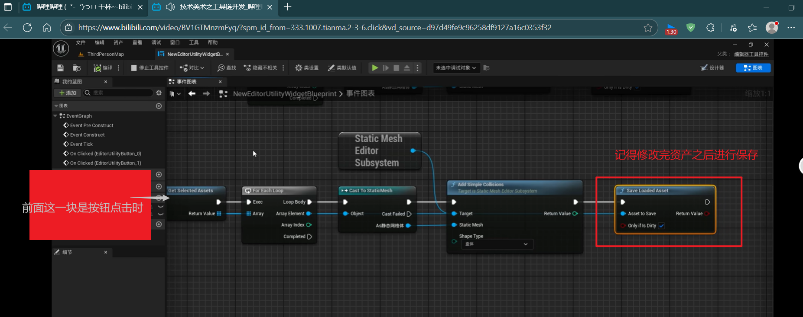

#### 虚幻引擎中，节点K2Node是什么意思？

K2Node是一个很重要的基类，用于构建蓝图中可视化脚本的各个节点，以下是含义几作用：

- K2: 代表蓝图系统第二代，这一代对底层架构进行重构，极大增强了蓝图功能和性能。
- Node:蓝图中，节点是基本单元
- K2Node:所有蓝图节点的基类，为接口提供了通用的功能和接口，是节点系统的核心支撑。

用途：

- 节点创建：开发者想要创建自定义节点就要继承K2Node类，然后重写方法

### 编辑器工具链:

直接在Editor中选择预设的编辑器工具即可Editor Utility

该蓝图可以打开一个用户界面，直接绑定一些按钮就能够实现一键操作某些东西的行为。而且引擎中有预设的一系列节点用于处理资产：“Get Select xxxx” 

- 在该utility中绑定按钮
- 创建Get Select xxx 之后通过cast一下
-  将资产通过对应的子系统进行相关修改
- 重要！修改之后记得进行保存！

使用编辑器工具链的时候操作步骤：

右键该工具--》点击运行--》选择要操作的资产--》再点击按钮就可以了。

## 事件分发器

假设一个Actor_sell有一个事件分发器。

触发行为：在进入范围和出去范围分发事件，并且传递一个bool参数

另外两个Actor1 and Actor2

行为：

- Event begin play 的时候 通过Actor_sell的引用进行绑定事件。绑定事件之后，可以在该Actor1或者Actor2选择触发某个Event进行响应逻辑。

假如在某些情况下Actor1或者Actor2不想监听该事件了，那么直接进行解绑就行，解绑的时候带上绑定的Event，或者直接调用**解绑绑定的所有事件**的蓝图节点。